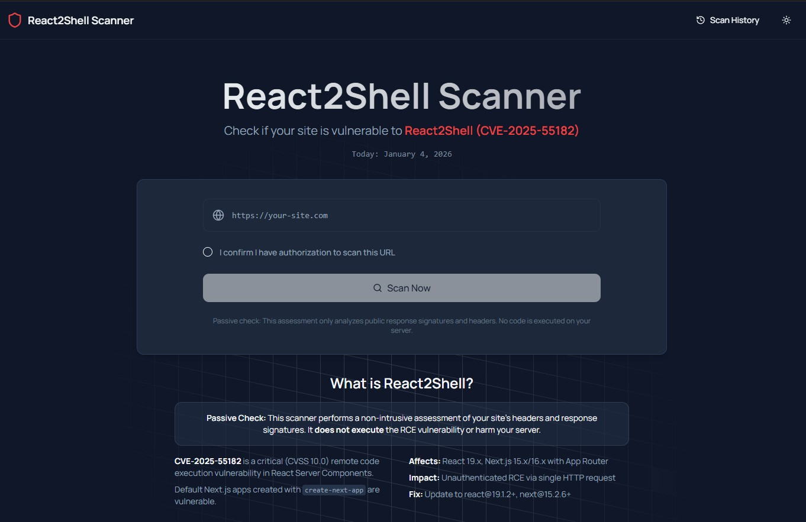

# React2Shell Scanner



A powerful vulnerability scanner designed to detect **React2Shell (CVE-2025-55182)**, a critical remote code execution vulnerability in React Server Components.

### Passive Check
This scanner performs a non-intrusive assessment of your site's headers and response signatures. It **does not execute** the RCE vulnerability or harm your server.

## Overview

React2Shell Scanner helps developers and security researchers identify if their Next.js (App Router) or other React-based applications are vulnerable to the high-severity CVE-2025-55182 exploit discovered in June 2025.

### Key Features
- **Fingerprinting**: Automatically detects the framework and RSC usage.
- **Safe Probing**: Performs non-destructive checks to confirm vulnerability presence.
- **AI-Powered Fixes**: Generates copy-paste prompt templates for IDE-based fixes.

## How it Works

The React2Shell Scanner performs a multi-stage, non-destructive assessment to determine if a target is vulnerable to CVE-2025-55182.

### 1. URL Validation & Normalization
- Validates that the input is a properly formatted URL.
- Blocks scanning of private IP ranges (localhost, 127.0.0.1, 10.x.x.x, etc.) to prevent SSRF (Server-Side Request Forgery) and internal network probing.
- Normalizes the URL for consistent reporting.

### 2. Framework Fingerprinting
The scanner performs a passive GET request to identify the underlying technology stack:
- **Framework Detection**: Looks for signatures of Next.js, Remix, and other React-based frameworks in HTTP headers (`X-Powered-By`, `X-Nextjs-Cache`) and HTML source code.
- **RSC Detection**: Checks for React Server Component (RSC) usage by looking for scripts like `__next_f` or specific `Accept` header handling.
- If no RSC usage is detected, the scan concludes early as the site is not affected by this specific vulnerability.

### 3. Safe Vulnerability Probing
If RSC is detected, the scanner sends a carefully crafted, non-destructive `POST` request to test for the vulnerability:

- **Next-Action Protocol**: Uses the `Next-Action` header (pointing to a common system-level action ID) to reach the vulnerable React Server DOM parsing logic.
- **Multipart Form Payload**: Transmits a specifically malformed `multipart/form-data` payload designed to trigger a parsing error in vulnerable versions of React.
- **Validated RSC Probe**: The request includes a multipart payload with:
  - Part `name="1"` containing: `{}`
  - Part `name="0"` containing: `["$1:a:a"]`
- **Next.js Headers**: Includes required headers like `Next-Action: x`, `Next-Router-State-Tree`, and specific request IDs to ensure the payload reaches the vulnerable server-side logic.
- **No Remote Execution**: This probe is designed **only** to trigger a predictable server-side error, not to execute arbitrary commands. It confirms the vulnerability by analyzing the server's error response signatures.

### 4. Response Analysis & Confidence Scoring
The scanner evaluates the server's response to determine vulnerability status:
- **High Confidence**: The server returns an HTTP 500 error with the validated RSC error digest signature (`E{"{"}"digest"..."}`). This confirms the server attempted to parse the malformed RSC reference and crashed due to the missing `hasOwnProperty` check in vulnerable versions.
- **Medium Confidence**: The server returns an HTTP 500 error without a specific digest, or shows other signs of unexpected state handling.
- **Not Vulnerable**: The server correctly handles the malformed request, returns a 400-level error, or is protected by a WAF/middleware that blocks the probe.

## Tech Stack

- **Framework**: [Next.js 15](https://nextjs.org/) (Pages Router)
- **Database**: [SQLite](https://www.sqlite.org/) with [Drizzle ORM](https://orm.drizzle.team/)
- **UI Components**: [shadcn/ui](https://ui.shadcn.com/), [Tailwind CSS](https://tailwindcss.com/)
- **Icons**: [Lucide React](https://lucide.dev/)

## Getting Started

### Prerequisites
- Node.js 18+
- npm or yarn

### Installation

1. **Clone the repository**:
   ```bash
   git clone https://github.com/AIAfterDark/react2shellscan.git
   cd react2shellscan
   ```

2. **Install dependencies**:
   ```bash
   npm install
   ```

3. **Set up the database**:
   ```bash
   npm run db:push
   ```

4. **Run the development server**:
   ```bash
   npm run dev
   ```

Open [http://localhost:3000](http://localhost:3000) with your browser to see the result.

## Project Structure

- `src/pages`: Application pages and routing.
- `src/app/api`: Server-side API routes for scanning.
- `src/lib/scanner`: Core vulnerability detection logic.
- `src/components`: Reusable UI components.
- `src/lib/db`: Database schema and configuration.

## ⚠️ Disclaimer

This tool is for educational and authorized security testing purposes only. Only scan applications you own or have explicit permission to test. The authors are not responsible for any misuse of this tool.

## License

MIT License - see the [LICENSE](LICENSE) file for details.
